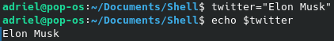
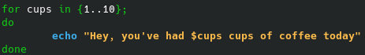

# Sumário
- [Sumário](#sumário)
- [Introdução](#introdução)
  - [Criando um Arquivo](#criando-um-arquivo)
  - [Executando um Arquivo](#executando-um-arquivo)
    - [Permissões de Usuário](#permissões-de-usuário)
      - [Alterando a permissão](#alterando-a-permissão)
- [Variáveis e Argumentos](#variáveis-e-argumentos)
  - [Variáveis do Sistema](#variáveis-do-sistema)
  - [Criando as Próprias Variáveis](#criando-as-próprias-variáveis)
- [Expressões Aritméticas](#expressões-aritméticas)
  - [Operadores Aritméticos](#operadores-aritméticos)
- [Estruturas de Controle](#estruturas-de-controle)
  - [Estruturas Condicionais](#estruturas-condicionais)
    - [If-Else](#if-else)
    - [Switch Case](#switch-case)
    - [Operadores Lógicos](#operadores-lógicos)
  - [Repetição](#repetição)
    - [For](#for)
    - [While](#while)
    - [Until](#until)
    - [Break e Continue](#break-e-continue)
- [Funções](#funções)
- [Comandos](#comandos)
  - [Navegação Pelo Sistema de Arquivos](#navegação-pelo-sistema-de-arquivos)
  - [Manipulação de Arquivos](#manipulação-de-arquivos)
    - [Leitura de Arquivos](#leitura-de-arquivos)
    - [Escrita em Arquivos](#escrita-em-arquivos)
  - [Redirecionamento](#redirecionamento)
  - [Aliases](#aliases)
- [Outros Materiais](#outros-materiais)

# Introdução
- Editor de Textos: **Nano**
- Linguagem do Guia: **Markdown**
- Shell: **BASH**
- 
## Criando um Arquivo
1. Através do terminal digite
    ```
    nano arquivo.sh
    ```
2. Agora, na primeira linha de arquivo.sh, digite o **cabeçalho** abaixo. Isso fará com que o bash identifique qual linguagem de *script* está sendo utilizada em `arquivo.sh`
    ```
    #!/bin/bash
    ```
3. Agora digite todos os comando que você deseja que `arquivo.sh` rode e salve as alterações.

## Executando um Arquivo
1. Para rodar seu arquivo shell, digite o seguinte comando no diretório em que se encontra `arquivo.sh`

    ```
    bash arquivo.sh
    ```

### Permissões de Usuário
Outra maneira possível é utilizar
```
./arquivo.sh
```
Entretando, de início, isso não funcionará, uma vez que `arquivo.sh` não possui permissão para executar.

No exemplo abaixo foi utilizado o comando `ls -l` para mostrar quais permissões o arquivo `himom.sh` possui. Dê uma olhada:


O arquivo `himom.sh` possui permissão apenas para ler (*read*) e escrever (*write*). Isso é indicado pela string que aparece no começo da resposta `(-rw-...)`. Para que ele tenha permissão para executar, é necessário que haja um `x` no lugar do travessão após o `w`. 

#### Alterando a permissão
Digite o comando
```
chmod +x arquivo.sh
```
Agora `arquivo.sh` possui permissão de execução. Portanto, pode ser executado através de 
```
./arquivo.sh
```

# Variáveis e Argumentos
Tudo o que vem após o comando de execução de um programa é chamado de argumento. Veja a estrutura e o exemplo abaixo:

```
user@host:~$ ./arquivo.sh argumento
```


Nesse caso, `Adriel` é um argumento. Vejamos como isso funciona dentro desse código:


`name=$1` indica para o programa que a variável `name` receberá o valor que for passado no primeiro argumento.

Caso quisessemos definir uma variável dentro do código, poderia ser da seguinte maneira:


E quando precisasse referenciá-la, basta digitar `$name` no local apropriado.
 

## Variáveis do Sistema
- `$RANDOM`: Guarda um valor aleatório entre 0 e 32767
- `$SHELL`: Guarda o shell atual
- `$USER`: Guarda o usuário atual
- `$PWD`: Guarda o diretório atual
- `$HOSTNAME`: Guarda o computador atual
- 
## Criando as Próprias Variáveis
No próprio terminal você pode definir variaveis. Veja o exemplo à seguir


Entretanto, definir a variável desa forma não permite que ela seja usada, por exemplo, em processos filhos (scripts). Para isso é necessário exportar a variável. Isso é possível da seguinte maneira:

```
export variavel
```

Entretanto, fazer isso diretamente pela linha de comando não permitirá que ela seja acessível para sempre; somente enquanto durar a presente conexão com o terminal. Para fazer com que uma variável sempre esteja acessíve, é necessário que ela seja **declarada** e **exportada** no arquivo `.bashrc`. Veja o exemplo abaixo


# Expressões Aritméticas
Para realizar uma expressão aritmética é necessário seguir a seguinte estrutura

```
$((a+b))
``` 

Ou seja, a expressão deve estar entre 2 pares de parêntesis e antes dos parêntesis deve a haver um cifrão

## Operadores Aritméticos


# Estruturas de Controle
## Estruturas Condicionais
### If-Else
### Switch Case
### Operadores Lógicos

## Repetição
### For
O `for` segue a estrutura a seguir:
```
for {range}; do
    acao
done
```

Veja o exemplo abaixo:



No caso acima a variável `cups` irá assumir os valores definidos no entre chaves (`{}`). Ou seja, vai variar de 1 (inclusive) a 10 (inclusive).

Outra maneira de se usar o laço `for` é definindo que a variável de controle assuma valores não-numéricos.
### While
### Until
### Break e Continue

# Funções

# Comandos
## Navegação Pelo Sistema de Arquivos
## Manipulação de Arquivos
### Leitura de Arquivos
### Escrita em Arquivos
## Redirecionamento
## Aliases

# Outros Materiais
- [Documentação do Bash](https://www.gnu.org/software/bash/manual/)