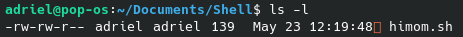

# Criar um arquivo shell (.sh)
**Tutorial para se utilizar o BASH (Bourne Again Shell)**

Através do terminal digite
```
nano arquivo.sh
```
Agora, na primeira linha de arquivo.sh, digite o cabeçalho abaixo. Isso fará com que o bash identifique qual linguagem de script está sendo utilizada em arquivo.sh
```
#!/bin/bash
```
Agora digite todos os comando que você deseja que arquivo.sh rode e salve as alterações.

---
# Rodar um arquivo shell
Para rodar seu arquivo shell, digite o seguinte comando no diretório em que se encontra arquivo.sh

```
bash arquivo.sh
```
## Permissões de Usuário
Outra maneira possível é utilizar
```
./arquivo.sh
```
Entretando, de início, isso não funcionará, uma vez que arquivo.sh não possui permissão para executar.

Olhe o exemplo abaixo

O arquivo himom.sh possui permissão paenas para ler (read) e escrever (write). Isso é indicado pela string que aparece no começo da resposta `(-rw-...)`. Para que ele tenha permissão para executar, é necessário que haja um `x` no lugar do travessão após o `w`. 

### Alterando a permissão
Digite o comando
```
chmod +x arquivo.sh
```
Agora arquivo.sh pode ser executado através de 
```
./arquivo.sh
```

---
# Comandos

- echo
    - retorna para o terminal o argumento que lhe for dado.
    ```
    echo "Hi Mom"
    //Hi Mom
    -> Hi Mom é escrito no terminal
    ```
- sleep
    - "dorme" por x segundos.
    ```
    sleep 3
    -> faz o programa dormir por 3 segundos
    ```
- 