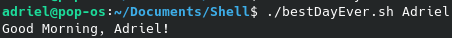
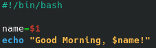
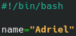

# Criar um arquivo shell (.sh)
**Tutorial para se utilizar o BASH (Bourne Again Shell)**

Através do terminal digite
```
nano arquivo.sh
```
Agora, na primeira linha de arquivo.sh, digite o **cabeçalho** abaixo. Isso fará com que o bash identifique qual linguagem de *script* está sendo utilizada em `arquivo.sh`
```
#!/bin/bash
```
Agora digite todos os comando que você deseja que `arquivo.sh` rode e salve as alterações.

---
# Rodar um arquivo shell
Para rodar seu arquivo shell, digite o seguinte comando no diretório em que se encontra `arquivo.sh`

```
bash arquivo.sh
```
## Permissões de Usuário
Outra maneira possível é utilizar
```
./arquivo.sh
```
Entretando, de início, isso não funcionará, uma vez que `arquivo.sh` não possui permissão para executar.

Olhe o exemplo abaixo:


O arquivo `himom.sh` possui permissão paenas para ler (*read*) e escrever (*write*). Isso é indicado pela string que aparece no começo da resposta `(-rw-...)`. Para que ele tenha permissão para executar, é necessário que haja um `x` no lugar do travessão após o `w`. 

### Alterando a permissão
Digite o comando
```
chmod +x arquivo.sh
```
Agora arquivo.sh pode ser executado através de 
```
./arquivo.sh
```
---

# Variáveis e Argumentos
Tudo o que vem após o comando de execução de um programa é chamado de argumento. Veja o exemplo abaixo:



Nesse caso, `Adriel` é um argumento. Vejamos como isso funciona dentro do código:



`name=$1` indica para o programa que a variável `name` receberá o valor que for passado no primeiro argumento

Caso quisessemos definir uma variável dentro do código, poderia ser da seguinte maneira:



E quando precisasse referenciá-la, basta digitar `$name`
 

 ## Variáveis do Sistema
 - `$RANDOM`: Guarda um valor aleatório entre 0 e 32767
- `$SHELL`: Guarda o shell atual
- `$USER`: Guarda o usuário atual
- `$PWD`: Guarda o diretório atual
- `$HOSTNAME`: Guarda o computador atual

### Criando as próprias variáveis
No próprio terminal você pode definir variaveis. Veja o exemplo à seguir


Entretanto, definir a variável desa forma não permite que ela seja usada, por exemplo, em processos filhos (scripts). Para isso é necessário exportar a variável. Isso é possível da seguinte maneira:

```
export variavel
```

Entretanto, fazer isso diretamente pela linha de comando não permitirá que ela seja acessível para sempre; somente enquanto durar a presente conexão com o terminal. Para fazer com que uma variável sempre esteja acessíve, é necessário que ela seja adicionada no arquivo `.bashrc`.

## Expressões aritméticas
Para realizar uma expressão aritmética é necessário seguir a seguinte estrutura

```
$((a+b))
``` 

Ou seja, a expressão deve estar entre 2 pares de parêntesis e antes dos parêntesis deve a haver um cifrão

---
# Comandos

- `echo`: retorna para o terminal o argumento que lhe for dado.
    ```
    echo "Hi Mom"
    //Hi Mom é escrito no terminal
    ```
- `sleep`: "dorme" por x segundos.
    ```
    sleep 3
    //faz o programa dormir por 3 segundos
    ```
- 